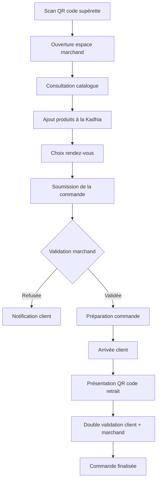
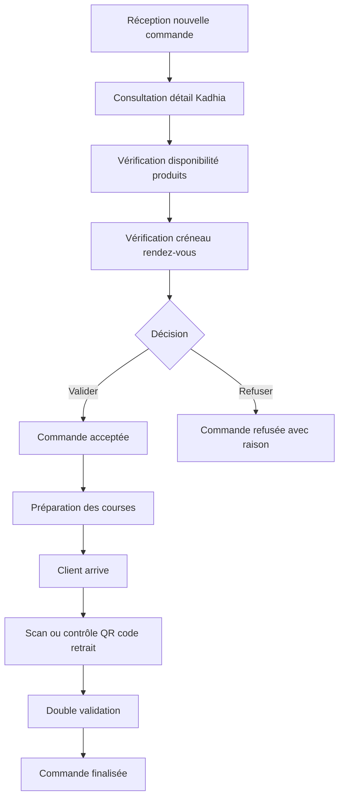

# Click & Collect Supérette Tunisie

Application de click and collect destinée aux supérettes en Tunisie.

Le client scanne un QR code dans une supérette, accède à l'espace de commande du magasin, fait ses courses en ligne, choisit un créneau de rendez-vous, puis récupère sa **Kadhia** après validation du marchand.

## Vision produit

L'objectif est de simplifier les courses du quotidien dans les supérettes tunisiennes :

- réduire le temps d'attente en magasin ;
- permettre au client de préparer sa liste de courses depuis son téléphone ;
- permettre au marchand de valider, préparer et finaliser la commande ;
- sécuriser la remise avec un QR code de retrait ;
- proposer une expérience bilingue français / arabe ;
- utiliser le dinar tunisien comme devise de référence.

## État du projet

Version actuelle : backend MVP avancé — post PR #104.

Sprints et blocs backend livrés :

- Foundation ;
- Theme / branding ;
- Product reference ;
- Customer ordering ;
- Merchant workflow core ;
- Auth client ;
- Sprint 4 — Secure pickup ;
- Sprint 3b — Merchant operational maturity ;
- Sprint 5 — Administration minimale : S5-001 et S5-002 livrées.

Sprint courant : Sprint 5 — Administration minimale.

Dernières PRs livrées :

- PR #103 — S5-001 : lecture admin des comptes marchands ;
- PR #104 — S5-002 : lecture admin des supérettes.

Prochaine étape recommandée : S5-003 — création/mise à jour admin des supérettes ou gestion admin des comptes marchands selon priorité produit.

## Principe général

1. Le client scanne le QR code de la supérette.
2. Il arrive sur l'espace digital de la supérette.
3. Il consulte les produits disponibles.
4. Il ajoute les produits à sa Kadhia.
5. Il choisit un créneau de rendez-vous pour récupérer ses courses.
6. Il soumet sa demande au marchand.
7. Le marchand vérifie la disponibilité des produits et du créneau.
8. Le marchand valide ou refuse la commande.
9. Si la commande est validée, le marchand prépare les courses.
10. À l'arrivée du client, un QR code de retrait est présenté.
11. Le marchand et le client valident la transaction.
12. La commande est finalisée.

## Vocabulaire métier

| Terme | Définition |
|---|---|
| Supérette | Commerce local proposant des produits du quotidien. |
| Marchand | Responsable ou employé de la supérette qui gère les commandes. |
| Client | Utilisateur qui scanne le QR code et prépare sa commande. |
| Kadhia | Courses / panier du client, terme local utilisé dans le produit. |
| QR code magasin | QR code permettant d'accéder à l'espace de commande d'une supérette. |
| QR code de retrait | QR code présenté au moment de la récupération pour valider la remise. |
| Rendez-vous | Créneau choisi par le client pour venir récupérer sa commande. |
| TND | Dinar tunisien, devise utilisée pour les prix et les totaux. |

## Langues et localisation

L'application doit être utilisable en :

- français ;
- arabe.

La devise par défaut est le **dinar tunisien (TND)**.

Les formats à prévoir :

- prix : affichage en TND ;
- dates et heures : format compréhensible localement ;
- interface RTL pour l'arabe si nécessaire.

## Parcours client principal



## Parcours marchand principal



## Statuts de commande

| Statut | Description |
|---|---|
| `draft` | Panier en cours côté client. |
| `submitted` | Commande envoyée au marchand. |
| `accepted` | Commande acceptée par le marchand. |
| `partially_accepted` | Commande acceptée partiellement ; la Kadhia repasse en `draft` pour ajustement client. |
| `rejected` | Commande refusée par le marchand. |
| `preparing` | Commande en préparation. |
| `ready` | Commande prête à être récupérée. |
| `pickup_pending` | Client arrivé, validation en cours. |
| `completed` | Commande finalisée. |
| `cancelled` | Commande annulée. |

## Rôles

### Client

- scanner un QR code magasin ;
- consulter le catalogue ;
- composer sa Kadhia ;
- choisir un rendez-vous ;
- suivre le statut de la commande ;
- présenter un QR code de retrait ;
- valider la réception.

### Marchand

- gérer les informations de la supérette ;
- gérer les produits et les prix ;
- recevoir les commandes ;
- accepter ou refuser une commande ;
- préparer la commande ;
- valider la remise au client.

### Administrateur plateforme

- consulter les comptes marchands ;
- consulter les supérettes ;
- gérer les supérettes ;
- gérer les comptes marchands ;
- superviser les commandes ;
- consulter les métriques ;
- gérer les langues et paramètres globaux ;
- configurer le thème visuel global de la plateforme.

## Périmètre MVP

Le MVP couvre :

- accès à une supérette via QR code ;
- catalogue produit simple ;
- panier client ;
- choix de rendez-vous ;
- validation ou refus par le marchand ;
- suivi des statuts ;
- QR code de retrait ;
- double validation au retrait ;
- personnalisation visuelle par supérette (couleurs + police) ;
- interface français / arabe ;
- prix en dinars tunisiens.

Hors périmètre MVP initial :

- applications mobiles natives iOS / Android ;
- paiement en ligne ;
- livraison à domicile ;
- programme de fidélité avancé ;
- gestion de stock complexe multi-entrepôts ;
- marketplace multi-marchands avec panier partagé.

## Structure technique MVP

Le MVP est organisé autour de deux applications seulement :

1. `apps/frontend/` : frontend web responsive pour les espaces client, marchand et admin ;
2. `apps/backend/` : backend API, logique métier, sécurité, persistance et intégrations.

```text
click-and-collect-superette/
├── apps/
│   ├── frontend/
│   └── backend/
├── docs/
│   ├── adr/
│   ├── architecture/
│   └── product/
└── README.md
```

Aucune application mobile native n'est prévue dans le MVP. La décision est documentée dans `docs/adr/0001-front-back-only-mvp.md`.

## Documentation produit et technique

La documentation produit est organisée dans `docs/product/` :

- `docs/product/epics.md` : vision PO, epics et découpage fonctionnel ;
- `docs/product/user-stories/` : une user story par fichier.

La documentation technique est organisée dans :

- `AI_CONTEXT.md` : contexte court de référence pour les agents IA ;
- `docs/architecture/api-contract.md` : contrat API ;
- `docs/architecture/front-back-structure.md` : structure frontend / backend du MVP ;
- `docs/adr/0001-front-back-only-mvp.md` : décision de ne garder que frontend + backend pour le MVP ;
- `docs/Sprint5/README.md` : cadrage du sprint d'administration minimale.

## Références utiles

- ISO 4217 — code devise du dinar tunisien : https://www.iso.org/iso-4217-currency-codes.html
- Documentation GitHub Markdown : https://docs.github.com/en/get-started/writing-on-github
- Documentation Mermaid : https://mermaid.js.org/
