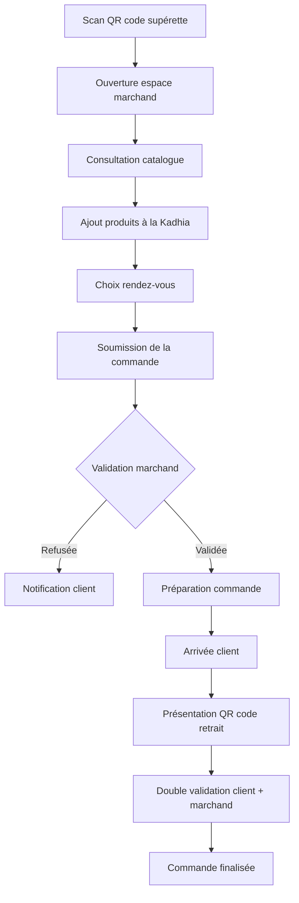
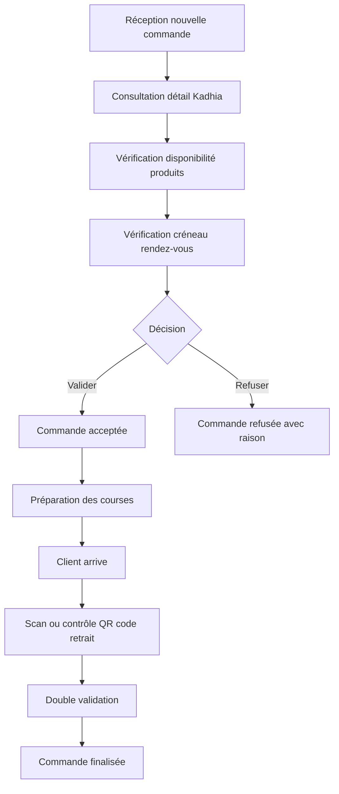

# Click & Collect Supérette Tunisie

Application de click and collect destinée aux supérettes en Tunisie.

Le client scanne un QR code dans une supérette, accède à l'espace de commande du magasin, fait ses courses en ligne, choisit un créneau de rendez-vous, puis récupère sa **Kadhia** après validation du marchand.

## Vision produit

L'objectif est de simplifier les courses du quotidien dans les supérettes tunisiennes :

- réduire le temps d'attente en magasin ;
- permettre au client de préparer sa liste de courses depuis son téléphone ;
- permettre au marchand de valider, préparer et finaliser la commande ;
- sécuriser la remise avec un QR code de retrait ;
- proposer une expérience bilingue français / arabe ;
- utiliser le dinar tunisien comme devise de référence.

## État du projet au 4 juin 2026

Le cœur MVP est livré sur `main` : Sprints 0 à 9, backend Symfony/API Platform, frontend client, backoffice admin et espace marchand. Le Sprint 10 est clôturable : les Must de durcissement bêta, observabilité, QR magasin imprimable et checklist d'activation supérette sont livrés.

Blocs livrés :

- Auth client : inscription, login JWT, profil, reset password ;
- parcours client : accès supérette par QR, catalogue, Kadhia, rendez-vous, soumission, suivi commande, notifications, QR de retrait et validation client ;
- parcours marchand : commandes actives, acceptation/refus/acceptation partielle, préparation, retrait sécurisé, historique, notifications, catalogue, créneaux, horaires, fermetures, QR magasin, thème, paramètres, onboarding et export CSV ;
- backoffice admin : auth admin, marchands, supérettes, référentiel produit, propositions, audit logs, dashboard KPI ;
- backend opérationnel : créneaux récurrents, fermetures exceptionnelles, délais automatiques, transport Messenger Doctrine, Supervisor, healthcheck, diagnostics et audit trail ;
- Sprint 10 fiabilité/terrain : runbook worker async, monitoring Messenger admin, KPI bêta admin, QR magasin imprimable PNG/PDF côté marchand et checklist d'activation supérette ;
- personnalisation visuelle par supérette ;
- images produits web/mobile livrées via S13-005 ;
- i18n client français / arabe avec RTL livré via S14-004 (#401), avec préférence langue marchand FR/AR livrée via #395.

Limites ouvertes :

- PWA marchand non livrée (PWA client livrée via S14-001) ;
- push notifications non livrées ;
- accessibilité WCAG de base non auditée ;
- décision bêta FR-only vs FR+AR (#358) à fermer comme non nécessaire, la bêta pouvant partir en FR+AR sur les parcours livrés.

Priorité recommandée : clôturer administrativement le Sprint 10 et fermer #358 comme décision absorbée par les livraisons FR/AR.

Issue documentaire courante : [#405](https://github.com/pivox/click-and-collect-superette/issues/405).

## Roadmap active

La roadmap d'exécution à partir de Sprint 14 est maintenant :

```text
docs/Sprint14/README.md
```

La synthèse stratégique est :

```text
docs/roadmap/launch-readiness-reorganization.md
```

L'ancienne roadmap `docs/roadmap/mvp-roadmap.md` a été supprimée pour éviter deux sources de vérité.

## Développement frontend avec Docker

Le frontend Next.js peut être lancé, buildé et linté sans installer Node.js localement.

### Lancer le frontend en watch / hot reload

```bash
# depuis la racine du repo
docker compose up frontend
```

L'application est disponible sur :

```text
http://localhost:3000
```

Le service `frontend` monte `./apps/frontend:/app` et conserve `node_modules` dans le volume Docker `frontend_node_modules`.

### Lancer uniquement le frontend sans les dépendances backend

```bash
docker compose run --rm --service-ports --no-deps frontend npm run dev
```

### Build frontend dans Docker

```bash
docker compose run --rm frontend npm run build
```

### Lint frontend dans Docker

```bash
docker compose run --rm frontend npm run lint
```

### Rebuild de l'image frontend

À faire après une modification de `apps/frontend/package.json`, `package-lock.json` ou `docker/frontend/Dockerfile` :

```bash
docker compose build frontend
```

## Principe général

1. Le client scanne le QR code de la supérette.
2. Il arrive sur l'espace digital de la supérette.
3. Il consulte les produits disponibles.
4. Il ajoute les produits à sa Kadhia.
5. Il choisit un créneau de rendez-vous pour récupérer ses courses.
6. Il soumet sa demande au marchand.
7. Le marchand vérifie la disponibilité des produits et du créneau.
8. Le marchand valide ou refuse la commande.
9. Si la commande est validée, le marchand prépare les courses.
10. À l'arrivée du client, un QR code de retrait est présenté.
11. Le marchand et le client valident la transaction.
12. La commande est finalisée.

## Vocabulaire métier

| Terme | Définition |
|---|---|
| Supérette | Commerce local proposant des produits du quotidien. |
| Marchand | Responsable ou employé de la supérette qui gère les commandes. |
| Client | Utilisateur qui scanne le QR code et prépare sa commande. |
| Kadhia | Courses / panier du client, terme local utilisé dans le produit. |
| QR code magasin | QR code permettant d'accéder à l'espace de commande d'une supérette. |
| QR code de retrait | QR code présenté au moment de la récupération pour valider la remise. |
| Rendez-vous | Créneau choisi par le client pour venir récupérer sa commande. |
| TND | Dinar tunisien, devise utilisée pour les prix et les totaux. |

## Langues et localisation

L'application doit être utilisable en :

- français ;
- arabe.

La devise par défaut est le **dinar tunisien (TND)**.

Les formats à prévoir :

- prix : affichage en TND ;
- dates et heures : format compréhensible localement ;
- interface RTL pour l'arabe si nécessaire.

## Parcours client principal


```mermaid
flowchart TD
    A[Scan QR code supérette] --> B[Ouverture espace marchand]
    B --> C[Consultation catalogue]
    C --> D[Ajout produits à la Kadhia]
    D --> E[Choix rendez-vous]
    E --> F[Soumission de la commande]
    F --> G{Validation marchand}
    G -- Refusée --> H[Notification client]
    G -- Validée --> I[Préparation commande]
    I --> J[Arrivée client]
    J --> K[Présentation QR code retrait]
    K --> L[Double validation client + marchand]
    L --> M[Commande finalisée]
```

## Parcours marchand principal


```mermaid
flowchart TD
    A[Réception nouvelle commande] --> B[Consultation détail Kadhia]
    B --> C[Vérification disponibilité produits]
    C --> D[Vérification créneau rendez-vous]
    D --> E{Décision}
    E -- Valider --> F[Commande acceptée]
    E -- Refuser --> G[Commande refusée avec raison]
    F --> H[Préparation des courses]
    H --> I[Client arrive]
    I --> J[Scan ou contrôle QR code retrait]
    J --> K[Double validation]
    K --> L[Commande finalisée]
```

## Statuts de commande

| Statut | Description |
|---|---|
| `draft` | Panier en cours côté client. |
| `submitted` | Commande envoyée au marchand. |
| `accepted` | Commande acceptée par le marchand. |
| `partially_accepted` | Commande acceptée partiellement ; la Kadhia repasse en `draft` pour ajustement client. |
| `rejected` | Commande refusée par le marchand. |
| `preparing` | Commande en préparation. |
| `ready` | Commande prête à être récupérée. |
| `pickup_pending` | Client arrivé, validation en cours. |
| `completed` | Commande finalisée. |
| `cancelled` | Commande annulée. |

## Rôles

### Client

- scanner un QR code magasin ;
- consulter le catalogue ;
- composer sa Kadhia ;
- choisir un rendez-vous ;
- suivre le statut de la commande ;
- présenter un QR code de retrait ;
- valider la réception.

### Marchand

- gérer les informations de la supérette ;
- gérer les produits et les prix ;
- recevoir les commandes ;
- accepter ou refuser une commande ;
- préparer la commande ;
- valider la remise au client.

### Administrateur plateforme

- consulter les comptes marchands ;
- consulter les supérettes ;
- gérer les supérettes ;
- gérer les comptes marchands ;
- superviser les commandes ;
- consulter les métriques ;
- gérer les langues et paramètres globaux ;
- configurer le thème visuel global de la plateforme.

## Périmètre MVP

Le MVP couvre :

- accès à une supérette via QR code ;
- catalogue produit simple ;
- panier client ;
- choix de rendez-vous ;
- validation ou refus par le marchand ;
- suivi des statuts ;
- QR code de retrait ;
- double validation au retrait ;
- personnalisation visuelle par supérette (couleurs + police) ;
- interface français / arabe ;
- prix en dinars tunisiens.

Hors périmètre MVP initial :

- applications mobiles natives iOS / Android ;
- paiement en ligne ;
- livraison à domicile ;
- programme de fidélité avancé ;
- gestion de stock complexe multi-entrepôts ;
- marketplace multi-marchands avec panier partagé.

## Structure technique MVP

Le MVP est organisé autour de deux applications seulement :

1. `apps/frontend/` : frontend web responsive pour les espaces client, marchand et admin ;
2. `apps/backend/` : backend API, logique métier, sécurité, persistance et intégrations.

```text
click-and-collect-superette/
├── apps/
│   ├── frontend/
│   └── backend/
├── docs/
│   ├── adr/
│   ├── architecture/
│   └── product/
└── README.md
```

Aucune application mobile native n'est prévue dans le MVP. La décision front/back est documentée dans `docs/adr/0001-front-back-only-mvp.md`.
