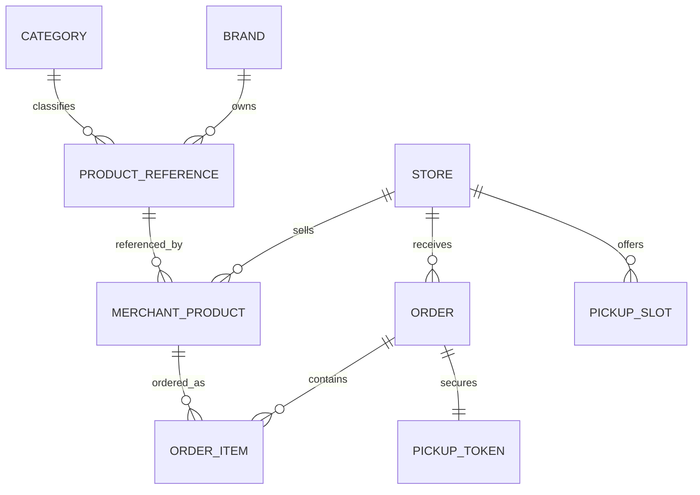

# Modèle de données — MVP

## Objectif

Définir les entités principales nécessaires au MVP Click & Collect Supérette Tunisie.

Ce document décrit un modèle fonctionnel. Il pourra ensuite être traduit en migrations, entités ORM et schéma API.

## Vue globale



## Store

Supérette ou commerce de proximité.

Champs MVP :

```yaml
id: uuid
name: string
slug: string
owner_user_id: uuid|null
address: string|null
city: string|null
country: TN
phone: string|null
is_active: boolean
qr_code_token: string
created_at: datetime
updated_at: datetime
```

Règle : `owner_user_id` est nullable dans le MVP pour ne pas bloquer les supérettes déjà créées ou seedées. Les futures routes marchand réservées au thème de supérette devront vérifier que l'utilisateur authentifié est le propriétaire de la supérette, avec exception pour `ROLE_ADMIN`.

## Merchant

Compte marchand rattaché à une ou plusieurs supérettes.

```yaml
id: uuid
store_id: uuid
email: string
phone: string|null
name: string
role: owner|employee
is_active: boolean
created_at: datetime
updated_at: datetime
```

## Brand

Marque produit.

```yaml
id: uuid
canonical_name: string
aliases: json
country: string|null
is_active: boolean
```

## Category

Catégorie ou sous-catégorie produit.

```yaml
id: uuid
parent_id: uuid|null
name_fr: string
name_ar: string|null
slug: string
sort_order: integer
is_active: boolean
```

## ProductReference

Produit global normalisé.

```yaml
id: uuid
brand_id: uuid
category_id: uuid
name_fr: string
name_ar: string|null
variant_fr: string|null
variant_ar: string|null
volume: decimal|null
unit: litre|millilitre|kilogramme|gramme|piece|paquet
barcode: string|null
aliases: json
country: TN
status: draft|pending_review|approved|rejected|archived
created_at: datetime
updated_at: datetime
```

## MerchantProduct

Produit vendu par une supérette.

```yaml
id: uuid
store_id: uuid
product_reference_id: uuid
price_tnd: decimal
is_available: boolean
is_visible: boolean
merchant_note: string|null
created_at: datetime
updated_at: datetime
```

Règle : le client commande un `MerchantProduct`, pas directement un `ProductReference`.

## PickupSlot

Créneau de retrait proposé par une supérette.

```yaml
id: uuid
store_id: uuid
starts_at: datetime
ends_at: datetime
capacity: integer|null
is_active: boolean
```

Pour le MVP, la capacité peut rester simple ou optionnelle.

## Order

Commande / Kadhia soumise au marchand.

```yaml
id: uuid
store_id: uuid
pickup_slot_id: uuid|null
customer_name: string|null
customer_phone: string|null
status: draft|submitted|accepted|rejected|preparing|ready|pickup_pending|completed|cancelled
currency: TND
total_amount_tnd: decimal
rejection_reason: string|null
submitted_at: datetime|null
accepted_at: datetime|null
ready_at: datetime|null
completed_at: datetime|null
created_at: datetime
updated_at: datetime
```

## OrderItem

Ligne de commande.

```yaml
id: uuid
order_id: uuid
merchant_product_id: uuid
product_snapshot: json
quantity: decimal
unit_price_tnd: decimal
line_total_tnd: decimal
```

`product_snapshot` permet de conserver le nom, la marque, le volume et l'unité au moment de la commande, même si le référentiel évolue ensuite.

## PickupToken

QR code de retrait lié à une commande.

```yaml
id: uuid
order_id: uuid
token_hash: string
status: active|used|expired|revoked
expires_at: datetime|null
used_at: datetime|null
created_at: datetime
```

## ProductProposal

Produit proposé par un marchand lorsqu'il ne trouve pas le produit dans le référentiel.

```yaml
id: uuid
store_id: uuid|null
merchant_id: uuid|null
brand_name: string
name_fr: string
name_ar: string|null
category_id: uuid|null
volume: decimal|null
unit: string|null
variant_fr: string|null
barcode: string|null
status: pending_review|approved|rejected|merged
review_note: string|null
created_product_reference_id: uuid|null
created_at: datetime
updated_at: datetime
```

## PlatformTheme

Thème visuel global par défaut de la plateforme. Singleton (un seul enregistrement, id fixe, seedé au déploiement).

```yaml
id: uuid
primary_color: string (hex)
secondary_color: string (hex)
accent_color: string (hex)
text_color: string (hex)
background_color: string (hex)
font_family: enum (inter|cairo|roboto|noto_sans_arabic|system)
base_font_size: integer (px, entre 14 et 20)
updated_at: datetime
```

Règle : ne peut pas être supprimé, seulement modifié. Modifiable uniquement par `ROLE_ADMIN`.

## ShopTheme

Thème visuel propre à une supérette. Optionnel (OneToOne nullable vers `Store`).

```yaml
id: uuid
store_id: uuid
primary_color: string (hex)
secondary_color: string (hex)
accent_color: string (hex)
text_color: string (hex)
background_color: string (hex)
font_family: enum (inter|cairo|roboto|noto_sans_arabic|system)
base_font_size: integer (px, entre 14 et 20)
created_at: datetime
updated_at: datetime
```

Règle : si présent, surcharge entièrement le `PlatformTheme` pour la supérette concernée. Si absent, la supérette hérite du `PlatformTheme`. Modifiable uniquement par le `ROLE_MERCHANT` propriétaire de la supérette.

## Contraintes importantes

- `ProductReference` doit être unique autant que possible par marque, nom, variante, volume, unité et catégorie.
- `MerchantProduct` doit être unique par `store_id` + `product_reference_id`.
- `OrderItem` doit stocker un snapshot produit.
- Le prix d'une ligne de commande doit rester figé après soumission.
- Le QR code de retrait ne doit être utilisable qu'une seule fois.
