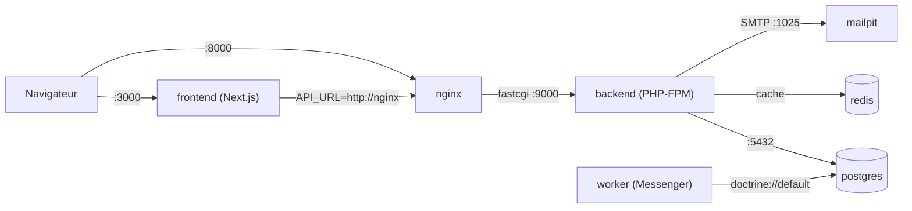

# Architecture — Plateforme centrale dockerisée

Date de cadrage : 2026-06-09
Rôle de cadrage : Tech Lead

Ce document décrit la plateforme centrale `click-and-collect-superette` **telle qu'elle existe
réellement** dans `docker-compose.yml` et les Dockerfiles du dossier `docker/`. Il sert de référence
pour la stratégie Docker de l'écosystème standalone (voir
`docs/architecture/standalone-ecosystem.md`).

> Ce document ne modifie pas l'orchestration existante : il la formalise. Aucun service, port ou volume
> n'est inventé.

## 1. Périmètre de la plateforme

La plateforme centrale est un monorepo produit qui réunit :

- `apps/backend/` — API Symfony 7 / API Platform 4, logique métier, persistance Doctrine ;
- `apps/frontend/` — frontend Next.js 14 (web responsive + PWA client/marchand/admin) ;
- worker Symfony Messenger — traitements asynchrones ;
- Nginx — reverse proxy devant PHP-FPM ;
- PostgreSQL — base de données principale ;
- Redis — cache / file légère ;
- Mailpit — serveur SMTP de développement ;
- un scraper outillé (profil `tools`, one-shot).

L'ensemble est orchestré en local par `docker-compose.yml` à la racine du repo.

## 2. Inventaire des services (depuis `docker-compose.yml`)

| Service | Image / Build | Port hôte → conteneur | Rôle |
|---|---|---|---|
| `postgres` | `postgres:16-alpine` | `5435 → 5432` | Base de données principale (`clickcollect`) |
| `redis` | `redis:7-alpine` | `6379 → 6379` | Cache / file légère |
| `backend` | build `docker/backend/Dockerfile` (PHP 8.4-fpm-alpine) | exposé `9000` (interne) | API Symfony via PHP-FPM |
| `worker` | build `docker/backend/Dockerfile` | — | `messenger:consume async` (`--time-limit=3600 --memory-limit=128M`, `restart: unless-stopped`) |
| `nginx` | `nginx:alpine` | `8000 → 80` | Reverse proxy → `backend:9000` (`docker/nginx/backend.conf`) |
| `frontend` | build `docker/frontend/Dockerfile` (Node 22-alpine) | `3000 → 3000` | Next.js (dev hot reload) |
| `mailpit` | `axllent/mailpit:latest` | `1025 → 1025` (SMTP), `8025 → 8025` (UI) | Capture des emails en dev |
| `scraper` | build `docker/scraper/Dockerfile` | — | Outil Python one-shot, **profil `tools`** (non démarré par défaut) |

## 3. Volumes

| Volume | Usage |
|---|---|
| `postgres_data` | Persistance PostgreSQL |
| `backend_vendor` | Dépendances Composer du backend (isolées du montage source) |
| `frontend_node_modules` | `node_modules` du frontend (isolés du montage source) |
| `frontend_next` | Cache de build `.next` |

## 4. Flux réseau

Points clés tirés de la configuration réelle :

- le frontend appelle le backend **via Nginx** (`API_URL: http://nginx`), et le navigateur via
  `NEXT_PUBLIC_API_URL: http://localhost:8000` ;
- Nginx ne sert que `public/` et délègue `index.php` à `backend:9000` (fastcgi) ;
- le transport Messenger est `doctrine://default` (file persistée en base) — le `worker` consomme la
  file `async` ;
- le backend envoie les emails de dev vers Mailpit (`MAILER_DSN: smtp://mailpit:1025`).

## 5. Stratégie Docker de l'écosystème

### 5.1 Principe par repo

- **Chaque repo serveur a son propre Dockerfile.** La plateforme en a déjà plusieurs
  (`docker/backend`, `docker/frontend`, `docker/nginx` via image officielle, `docker/scraper`).
- **La plateforme conserve son `docker-compose.yml` local.** Il reste l'outil de développement de la
  plateforme et **n'est pas dupliqué** dans les autres repos.
- **Le repo `click-and-collect-ai-agent`** apporte son propre Dockerfile et expose un service HTTP
  isolé ; il est buildé en image versionnée indépendante.
- **Le repo `click-and-collect-infra`** orchestre **staging et production** à partir d'**images Docker
  versionnées** (tags), en tirant les images publiées par chaque repo serveur. Il porte le réseau, le
  reverse proxy de production, la terminaison SSL et la configuration d'environnement.

### 5.2 Frontière dev ↔ prod

| Dimension | Dev (plateforme) | Prod (repo infra) |
|---|---|---|
| Orchestration | `docker-compose.yml` local | manifests / compose du repo `infra` |
| Code | volumes montés, hot reload | **images immuables versionnées** |
| Build | à la volée | images taguées, publiées en registre |
| Secrets | valeurs de dev en clair dans le compose | injectées par l'infra (vault / secrets CI) |

> Le `docker-compose.yml` local **n'est pas un artefact de production**. Les valeurs sensibles qu'il
> contient (`JWT_PASSPHRASE: changeme_jwt_passphrase`, identifiants Postgres `app/app`) sont des
> valeurs de **développement** et ne doivent jamais être reprises telles quelles en production.

### 5.3 Secrets et configuration

- **Pas de secret dupliqué entre repos.** Chaque repo fournit un `.env.example` documentant les clés
  attendues **sans valeurs réelles**.
- Les valeurs de production sont **injectées au déploiement** par le repo `infra` (variables
  d'environnement, secrets CI, vault) — jamais commitées.

### 5.4 Exigences de production (portées par le repo `infra`)

- **Backup PostgreSQL** régulier et restaurable ;
- agrégation et rétention des **logs** (backend, worker, nginx) ;
- **monitoring** (santé des services, file Messenger, métriques) ;
- terminaison **SSL** / HTTPS devant la plateforme.

Ces exigences ne sont **pas** ajoutées au compose local : elles sont la responsabilité du repo `infra`.
