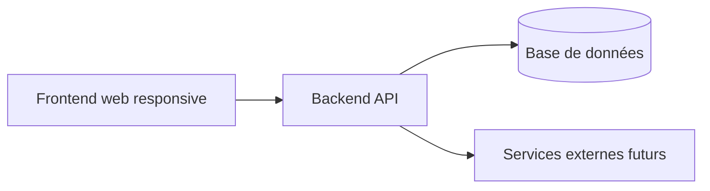

# Structure Frontend / Backend du MVP

## Objectif

Le projet est organisé pour livrer un MVP simple : un frontend web responsive et un backend API.

Il n'y a pas d'application mobile native dans le périmètre initial.

## Vue d'ensemble

```text
click-and-collect-superette/
├── apps/
│   ├── frontend/          # Interface web responsive
│   └── backend/           # API, métier, persistance
├── docs/
│   ├── adr/               # Décisions d'architecture
│   ├── architecture/      # Architecture technique
│   └── product/           # Vision produit, epics, user stories
└── README.md
```

## Application Frontend

Le dossier `apps/frontend/` contient l'interface web responsive.

Elle doit couvrir trois espaces métier :

- **client** : scan QR code, catalogue, Kadhia, rendez-vous, suivi commande, QR code de retrait ;
- **marchand** : commandes reçues, acceptation/refus, préparation, validation retrait, gestion catalogue/prix ;
- **admin plateforme** : gestion des supérettes, comptes marchands, référentiel produits, supervision.

Le frontend ne doit pas contenir de logique métier critique. Les règles de commande, prix, statuts et sécurité restent côté backend.

## Application Backend

Le dossier `apps/backend/` contient l'API centrale.

Responsabilités principales :

- authentification et autorisation ;
- gestion des rôles : client, marchand, admin ;
- référentiel produits Tunisie ;
- supérettes et marchands ;
- offres marchands, prix et historique ;
- commandes et statuts ;
- créneaux de retrait ;
- QR codes magasin et retrait ;
- notifications futures ;
- audit et supervision.

## Communication



## Règles de séparation

| Sujet | Frontend | Backend |
|---|---|---|
| Affichage catalogue | Oui | Fournit les données |
| Calcul prix officiel | Non | Oui |
| Statuts de commande | Affichage uniquement | Source de vérité |
| Validation marchand | Action utilisateur | Règles métier |
| QR code retrait | Affichage / scan | Génération / validation |
| Autorisations | Masquage UX | Contrôle réel |
| Référentiel produit | Consultation | Source de vérité |

## Hors périmètre MVP

- application iOS native ;
- application Android native ;
- application livreur ;
- application tablette séparée ;
- marketplace multi-marchands avec panier partagé ;
- paiement en ligne obligatoire.

## Évolution possible

Après validation du marché, le projet pourra évoluer vers :

- une PWA installable ;
- un wrapper Android ;
- une application mobile native ;
- une application dédiée préparateur/magasin ;
- des intégrations fournisseurs ou grossistes.

Ces évolutions ne doivent pas être créées dans la structure initiale tant qu'elles ne sont pas décidées.
