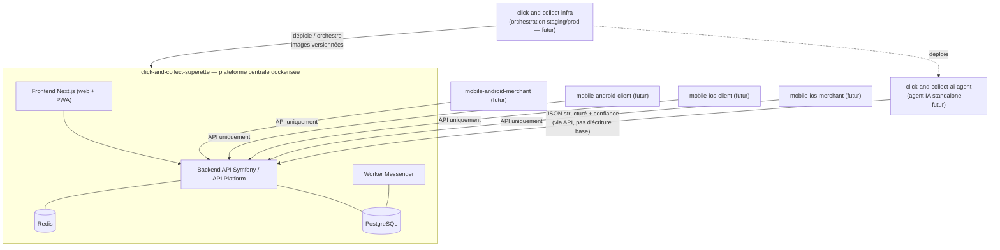

# Architecture — Écosystème standalone autour de la plateforme centrale

Date de cadrage : 2026-06-09
Rôle de cadrage : Tech Lead

Ce document formalise l'écosystème de dépôts qui gravite autour du repo
`click-and-collect-superette`. Il complète :

- `docs/architecture/dockerized-platform.md` — détail de la plateforme centrale dockerisée ;
- `docs/adr/ADR-standalone-ecosystem-and-dockerized-platform.md` — décision d'architecture ;
- `docs/adr/0005-mobile-channel-strategy.md` — stratégie PWA / natif (déjà actée).

## 1. Principe directeur

Le repo `click-and-collect-superette` **reste la plateforme centrale et la source de vérité métier**.
Il porte l'API, la logique métier, la persistance et le frontend web.

Tous les autres dépôts sont des **satellites standalones** :

- ils consomment l'API exposée par la plateforme ;
- ils ne dupliquent **aucune** logique métier ;
- ils n'écrivent **jamais** directement dans la base principale ;
- ils restent des projets indépendants, versionnés et déployés séparément.

> On ne transforme pas le repo actuel en monorepo plus gros. On ne déplace pas l'existant.
> Chaque nouveau composant est pensé comme un projet autonome **autour** de la plateforme.

## 2. Vue d'ensemble

## 3. Cartographie des dépôts

| Dépôt | Rôle | Statut | Dépend de l'API | Dockerfile propre |
|---|---|---|---|---|
| `click-and-collect-superette` | Plateforme centrale : backend API, frontend Next.js, worker Messenger, Nginx, PostgreSQL, Redis, Mailpit, Docker Compose local | **Existant** | — (la fournit) | Oui (backend, frontend, nginx, scraper) |
| `click-and-collect-ai-agent` | Agent IA standalone (périmètre à cadrer) | Futur | Oui | Oui (à créer) |
| `click-and-collect-infra` | Orchestration staging / production (images versionnées) | Futur | — (déploie) | Compose / manifests de déploiement |
| `click-and-collect-mobile-android-merchant` | App native Android marchand | Futur | Oui | Non (build mobile) |
| `click-and-collect-mobile-android-client` | App native Android client | Futur | Oui | Non (build mobile) |
| `click-and-collect-mobile-ios-client` | App native iOS client | Futur | Oui | Non (build mobile) |
| `click-and-collect-mobile-ios-merchant` | App native iOS marchand | Futur | Oui | Non (build mobile) |

## 4. Agent IA standalone — `click-and-collect-ai-agent`

Le futur agent IA est un **nouveau projet IA distinct et réservé**. Son **périmètre fonctionnel exact
sera cadré dans une issue dédiée** ; ce document ne pose que les **invariants d'architecture**, sans
figer le détail fonctionnel.

Invariants à respecter quel que soit le périmètre retenu :

- l'agent **consomme l'API** de la plateforme et ne duplique aucune logique métier ;
- il produit une **sortie JSON structurée** accompagnée d'un **score de confiance**, exploitable pour
  le **matching produit** côté plateforme ;
- il **n'écrit jamais directement dans la base principale** ;
- **l'API reste responsable du commit métier** : c'est elle qui valide, rapproche et persiste ;
- cas d'usage évoqués **à titre illustratif et non figé** : extraction depuis ticket, photo, rayon ou
  export → le périmètre réel est décidé hors de ce document.

> **Brique IA interne existante — non concernée.** Le backend contient déjà une brique d'extraction
> catalogue-photo (`MerchantCatalogPhotoImportExtractor*` + previewer de matching). Elle **reste interne
> à la plateforme et n'est pas déplacée** vers l'agent standalone. Les deux IA sont **indépendantes** :
> le nouvel agent n'est **pas** une migration de l'existant.

## 5. Stratégie mobile

La stratégie mobile reste celle déjà actée dans `docs/adr/0005-mobile-channel-strategy.md` :

- **PWA d'abord**, livrée dans `apps/frontend/` de la plateforme — pas de nouveau dépôt pour la PWA ;
- **apps natives uniquement post-lancement**, après franchissement du **gate terrain** (usage réel
  prouvé, limites PWA constatées, API stable, capacité de maintenance identifiée) ;
- **Android marchand prioritaire** si le besoin comptoir est confirmé ; **iOS marchand conditionnel** ;
- ordre de référence : Android marchand → Android client → iOS client → iOS marchand ;
- les apps natives **ne dupliquent aucune logique métier** : elles **consomment uniquement l'API** et
  reprennent les parcours déjà validés par la PWA.

## 6. Règles de gouvernance

- **Pas de duplication métier** : la logique reste dans la plateforme ; les satellites l'appellent.
- **Un Dockerfile par repo serveur** (plateforme et agent IA) ; les apps mobiles ont leur propre chaîne
  de build native.
- **Secrets jamais dupliqués entre repos** : chaque repo fournit un `.env.example` (clés sans valeurs
  réelles) ; les valeurs sont injectées au déploiement par le repo `infra`.
- **Contrat API = frontière** : tout nouveau besoin satellite passe par un contrat API documenté
  (`docs/architecture/api-contract.md`), jamais par un accès base direct.
- **Vocabulaire métier préservé** dans tous les repos : Kadhia, supérette, marchand, client,
  rendez-vous, retrait.
